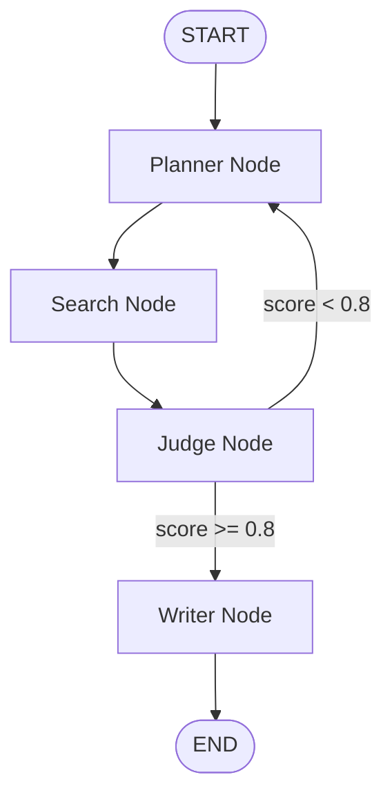

# Research Syndicate

If you want to research a highly technical topic, you usually end up digging through dozens of search pages, skipping past SEO marketing blogs, and manually parsing whitepapers just to find something reliable. It takes hours of manual filtering to get to a trustworthy answer.

Research Syndicate automates that workflow. It's a headless, multi-agent system built on LangGraph that acts like a small team of strict academic researchers. You give it a topic, and a cyclical graph of specialized agents plans queries, retrieves sources, grades them for academic rigor, and only writes a cited report once the sources actually clear a quality bar — regenerating the search itself if they don't.

## How the Graph Works

Instead of a single prompt trying to do everything at once, the system is a `StateGraph` with four nodes and one self-correcting loop:



**1. Planner** — Takes the raw topic and calls Gemini 2.5 Flash with a structured output schema (`PlannerOutput`) to produce 3–5 highly specific academic search queries, deliberately biased toward arXiv, IEEE, and DOI-style phrasing instead of generic web search terms.

**2. Search** — Runs every query through the Tavily API, restricted to a fixed allowlist of academic domains (`arxiv.org`, `ieeexplore.ieee.org`, `sciencedirect.com`, `nature.com`, `springer.com`, `researchgate.net`). Results from all queries accumulate into `raw_sources` using a LangGraph reducer (`Annotated[List[dict], operator.add]`), so nothing gets overwritten across the loop.

**3. Judge** — Acts as a strict peer reviewer. It scores the accumulated sources from 0.0–1.0 on academic rigor via a second structured-output call (`JudgeOutput`), deducting for marketing fluff or outdated material and rewarding peer-reviewed, technically dense content.

**4. Conditional routing** — If `quality_score >= 0.8`, the graph proceeds to the Writer. If not, it routes **back to the Planner** to generate different queries and try again — the actual self-correction mechanism, not just a retry with the same input.

**5. Writer** — Only runs once sources are approved. Synthesizes the raw source text into a Markdown report with strict inline numbered citations (`[1]`, `[2]`) and a matching `## References` section mapping every citation to its source URL.

The loop is bounded by `recursion_limit: 5` at the graph-execution level, guaranteeing the system terminates even if sources never clear the quality bar.

## Tech Stack

| Layer | Choice |
|---|---|
| Agent orchestration | LangGraph (`StateGraph`, conditional edges, reducers) |
| LLM | Google Gemini 2.5 Flash, structured output via Pydantic schemas |
| Search | Tavily API, domain-restricted to academic sources |
| Backend | FastAPI |
| Deployment | Docker |

## API

**POST** `/research`

**Request:**
```json
{
  "topic": "What is the current state of multi-agent reinforcement learning in 2026?"
}
```

**Response:**
```json
{
  "report": "# Multi-Agent Reinforcement Learning: 2026 Landscape\n\nMulti-agent reinforcement learning (MARL) has seen massive shifts... [1]\n\n## References\n[1] https://arxiv.org/abs/..."
}
```

## Running Locally

**With Docker:**

Create a `.env` file at the project root:
```env
GOOGLE_API_KEY=your_gemini_key
TAVILY_API_KEY=your_tavily_key
```

Then:
```bash
docker build -t research-syndicate .
docker run -p 8000:8000 --env-file .env research-syndicate
```

**Bare metal:**
```bash
pip install -r requirements.txt
uvicorn api:api --reload
```

Interactive API docs and a way to test the full agentic loop directly: `http://127.0.0.1:8000/docs`
